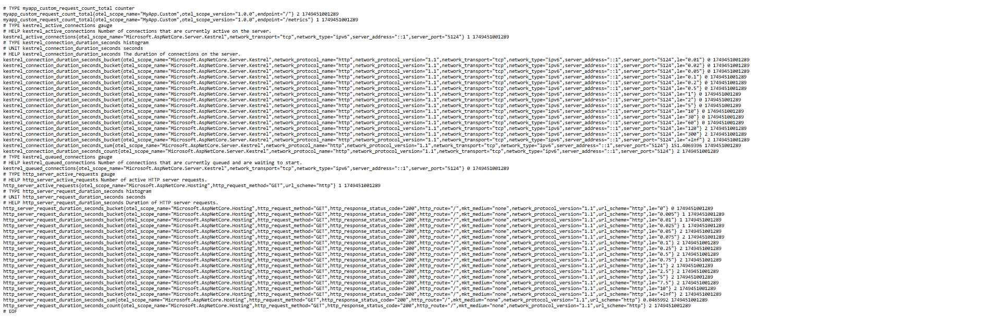
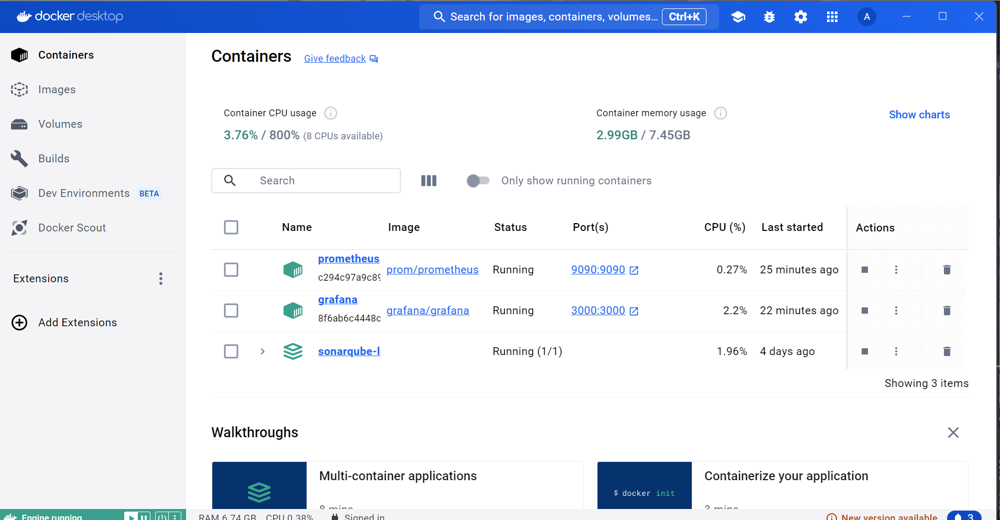
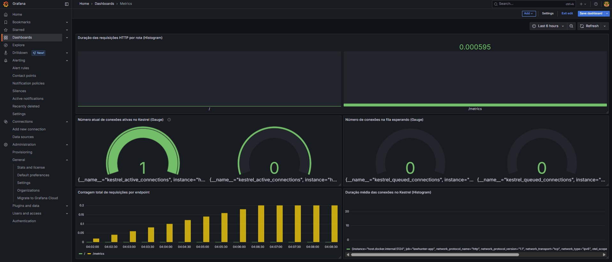

# Documentação: Monitoramento com OpenTelemetry, Prometheus e Grafana

## Introdução

Este documento descreve como configurar o monitoramento de uma aplicação ASP.NET Core usando OpenTelemetry para gerar métricas, Prometheus para coletá-las e Grafana para visualizá-las.

---

## Passo a passo para configurar o monitoramento

### 1. Expor métricas na aplicação ASP.NET Core com OpenTelemetry

- Adicione o pacote OpenTelemetry e configure o exportador Prometheus no seu `Program.cs`.
- Crie métricas customizadas usando a API `System.Diagnostics.Metrics`.
- Exponha o endpoint `/metrics` com os dados no formato Prometheus.

**Exemplo básico de configuração:**

```csharp
using OpenTelemetry.Metrics;
using System.Diagnostics.Metrics;

var builder = WebApplication.CreateBuilder(args);

var myMeter = new Meter("MyApp.Custom", "1.0.0");
var customCounter = myMeter.CreateCounter<int>("myapp_custom_request_count");

builder.Services.AddOpenTelemetry()
    .WithMetrics(builder =>
    {
        builder.AddPrometheusExporter();
        builder.AddMeter("MyApp.Custom", "Microsoft.AspNetCore.Hosting", "Microsoft.AspNetCore.Server.Kestrel");
    });

var app = builder.Build();

app.MapPrometheusScrapingEndpoint();

app.Use(async (context, next) =>
{
    customCounter.Add(1, new KeyValuePair<string, object?>("endpoint", context.Request.Path));
    await next();
});

app.Run();
```

### 2. Verificar o endpoint /metrics
Acesse no navegador ou terminal:

```bash
http://localhost:5000/metrics
```

<div style="display: flex; justify-content: center; gap: 20px; width: auto;">
  
</div>

Você verá as métricas geradas no formato Prometheus, incluindo a métrica customizada `myapp_custom_request_count`.

### 3. Configurar Prometheus para coletar métricas

Crie o arquivo prometheus.yml com o conteúdo:

```yaml
global:
  scrape_interval: 5s

scrape_configs:
  - job_name: 'lawhunter-app'
    metrics_path: /metrics
    static_configs:
      - targets: ['host.docker.internal:5124'] # Ajuste conforme o ambiente
```

Execute o Prometheus com o comando:
```bash
docker run -d -p 9090:9090 -v /caminho/para/prometheus.yml:/etc/prometheus/prometheus.yml --name prometheus prom/prometheus
```

### 4. Configurar Grafana para visualização

Inicie Grafana:

```bash
docker run -d -p 3000:3000 --name grafana grafana/grafana
```
<div style="display: flex; justify-content: center; gap: 20px; width: auto;">
  
</div>

Acesse:
`http://localhost:3000`

- Login padrão: admin / admin

- Configure Prometheus como fonte de dados:

- URL: http://host.docker.internal:9090 (ou http://localhost:9090)


### 5. Validar coleta no Prometheus

Acesse o painel do Prometheus:

```bash
http://localhost:9090
```

<div style="display: flex; justify-content: center; gap: 20px; width: auto;">
  
</div>

Execute consultas como nos exemplos abaixo e 
Confirme que as métricas da aplicação estão sendo coletadas corretamente:

### 6. Criar dashboard no Grafana

- Faça integração com o Prometheus
- Crie um painel novo
- Adicione consultas PromQL para monitorar métricas importantes (ver seção abaixo)

<div style="display: flex; justify-content: center; gap: 20px; width: auto;">
  
</div>

#### Métricas e consultas PromQL para o Grafana

| Nº | Métrica                                | Tipo      | PromQL                                                                                                                                                  | Descrição                                                          |
| -- | -------------------------------------- | --------- | ------------------------------------------------------------------------------------------------------------------------------------------------------- | ------------------------------------------------------------------ |
| 1  | `myapp_custom_request_count_total`     | Counter   | `sum by (endpoint) (rate(myapp_custom_request_count_total[5m]))`                                                                                        | Taxa de requisições por endpoint nos últimos 5 minutos.            |
| 2  | `kestrel_active_connections`           | Gauge     | `kestrel_active_connections`                                                                                                                            | Número atual de conexões ativas no servidor Kestrel.               |
| 3  | `kestrel_connection_duration_seconds`  | Histogram | `rate(kestrel_connection_duration_seconds_sum[5m]) / rate(kestrel_connection_duration_seconds_count[5m])`                                               | Duração média das conexões nos últimos 5 minutos.                  |
| 4  | `kestrel_queued_connections`           | Gauge     | `kestrel_queued_connections`                                                                                                                            | Quantidade de conexões na fila aguardando para serem atendidas.    |
| 5  | `http_server_active_requests`          | Gauge     | `http_server_active_requests`                                                                                                                           | Número atual de requisições HTTP em andamento.                     |
| 6  | `http_server_request_duration_seconds` | Histogram | `sum by (http_route) (rate(http_server_request_duration_seconds_sum[5m])) / sum by (http_route) (rate(http_server_request_duration_seconds_count[5m]))` | Duração média das requisições HTTP por rota nos últimos 5 minutos. |


### 7. Conclusão

Com esta configuração, sua aplicação ASP.NET Core estará totalmente monitorada:

- Geração e exportação de métricas com OpenTelemetry

- Coleta contínua com Prometheus

- Visualização e análise com Grafana


Você poderá identificar gargalos, medir desempenho e criar alertas baseados em métricas reais de produção.